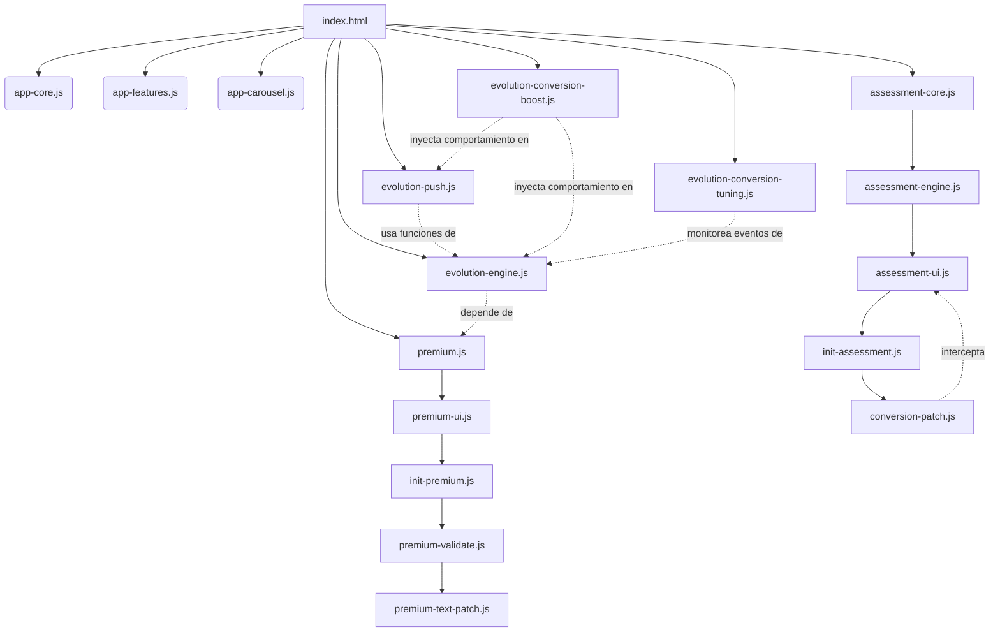

# RADIOGRAFÍA COMPLETA DEL SISTEMA ALMA IA

## 1. RESUMEN GENERAL
- **Nombre del proyecto:** ALMA IA (El Espejo de tu Destino)
- **Propósito de la app:** Plataforma espiritual interactiva que fusiona Cábala, Astrología y algoritmos de IA para ofrecer lecturas de tarot, cartas natales, oráculo libre y evaluaciones psicológicas. Todo enfocado en el crecimiento personal y autodescubrimiento.
- **Tipo de aplicación:** Web App (PWA) fuertemente dependiente de interacciones en el lado del cliente (Vanilla JS) y conexión a APIs externas para la generación de contenido.
- **Estado actual:** Producción / Testing previo a Google Play Store.
- **Tecnologías utilizadas:** 
  - **Frontend:** HTML5, CSS3 (Custom Properties, animaciones), Vanilla JavaScript (Modular).
  - **Backend (APIs):** Integración con Vercel Functions / Cloudflare Tunnels hacia instancias locales (Ollama) o servicios externos (Google Gemini).
  - **Persistencia:** `localStorage` y `sessionStorage` (No hay base de datos centralizada para usuarios estándar).
  - **Monetización:** Stripe Payment Links.

---

## 2. ARQUITECTURA COMPLETA

La aplicación está diseñada bajo una arquitectura **modular y sobrepuesta**. El núcleo base (`app-*.js`) maneja la funcionalidad general, mientras que las funcionalidades de monetización (`premium*.js`, `evolution*.js`) operan inyectándose o envolviendo las funciones originales sin reescribirlas, asegurando que si un módulo falla, la aplicación base no se rompa.

### 2.1. Módulos Base (Core)
*   **`app-core.js`**: Maneja el ciclo de vida de la aplicación, el enrutamiento visual (pantallas intro, auth, main), gestión de pestañas (tarot, natal, sueños, etc.) y la inicialización general.
*   **`app-features.js`**: Contiene la lógica de negocio para interactuar con la IA (Llamadas a `fetch` para Tarot, Horóscopo, Sueños, Código Vital, Oráculo Libre). Maneja estados de carga y visualización de resultados.
*   **`app-carousel.js` / `app-modal.js`**: Componentes de interfaz de usuario para presentar lecturas avanzadas (carrusel astral) y ventanas modales de interpretación detallada.

### 2.2. Módulo de Evaluación (Assessment Module)
Carpeta: `assessment-module/`
*   **`assessment-core.js`**: Base de datos de preguntas y patrones (Cognitivos y Psicológicos). Funciona de manera autónoma sin depender del resto del código.
*   **`assessment-engine.js`**: Lógica de barajado aleatorio (Fisher-Yates), manejo del estado del test (índice actual, puntaje), contador de tiempo de respuesta para perfilamiento cognitivo.
*   **`assessment-ui.js`**: Generación dinámica del DOM para renderizar el test, procesar la interacción, mostrar alertas anti-trampas (focus perdido) y calcular las categorías de los resultados finales.
*   **`init-assessment.js`**: Archivo de pegamento que conecta el módulo independiente con la UI principal de ALMA IA.

### 2.3. Sistema Premium Base
*   **`premium.js`**: Núcleo de la monetización. Detecta si un usuario ha pagado (verificando `?success` en la URL o `localStorage.getItem('premium') === 'true'`).
*   **`premium-ui.js`**: Genera dinámicamente en el DOM la pantalla superpuesta (Overlay) del paywall, bloqueando la vista de contenido exclusivo.
*   **`init-premium.js`**: Conecta los botones o funcionalidades específicas de la app base (ej: reportes completos) para que disparen el Overlay Premium si el usuario es gratuito.
*   **`premium-validate.js`**: **(Capa de Seguridad)** Neutraliza la activación automática de `?success` para prevenir que usuarios compartan la URL. Exige que el usuario confirme su pago ingresando los últimos caracteres de su correo antes de habilitar verdaderamente el acceso premium.
*   **`premium-text-patch.js`**: **(Capa de UX)** Reescribe en tiempo real los textos genéricos de `premium-ui.js` por textos más persuasivos (copywriting de ventas) sin tocar el archivo original.

### 2.4. Sistema de Conversión Inteligente (Evolution Module)
*   **`conversion-patch.js`**: Intercepta la función `asRenderSingleResult` del módulo de Evaluación. Muestra un "teaser" (análisis al 30% con blur en el texto) en lugar del resultado completo, obligando al usuario a ver el paywall para desbloquear el resto.
*   **`evolution-engine.js`**: Provee APIs globales (`evAI`, `evShowTeaser`, `evPaywall`, `evDopamine`, `evUrgency`) para crear inyecciones de conversión. Implementa el botón global fijo de desbloqueo y el reenganche básico.
*   **`evolution-push.js`**: Maneja los permisos de `Notification` nativos. Crea un "cronjob" simulado en el frontend con `setInterval` que verifica cada 30 minutos si es momento de enviar notificaciones push en franjas específicas (8-10h, 14-16h, 20-22h). Incluye control anti-spam (máx 3 al día).
*   **`evolution-conversion-boost.js`**: Capa agresiva. Activa el temporizador falso de "tiempo limitado" (FOMO), muestra banners de urgencia dinámicos por unos segundos, envía micro-dopamina automática, e inyecta notificaciones push silenciadas que redirigen a `/?from=push` para lanzar el teaser inmediato.
*   **`evolution-conversion-tuning.js`**: Capa adaptativa. Rastrea cuántas veces se ve el teaser y cuántos clics genera. Si la tasa de conversión es baja, acelera los tiempos y muestra mensajes más directos. Implementa el Paywall por Scroll (>60% de scroll) y las notificaciones falsas de "Usuarios que acaban de desbloquear" (simulación viral).
*   **`access-codes.js`**: Permite habilitar el modo premium temporal o módulos puntuales introduciendo códigos especiales (ej: para soporte o embajadores).

---

## 3. FLUJO DEL USUARIO

### 3.1. Camino del Usuario Nuevo (Gratuito)
1. **Entrada:** Llega a `index.html`. Pasa por la introducción y pantalla de registro/login simulado.
2. **Onboarding:** Se le muestra la UI principal. Se activa `evolution-conversion-tuning.js`, registrando su visita como usuario frío (Visit = 1).
3. **Interacción:** El usuario utiliza oráculos gratuitos.
4. **Fricción por Scroll:** Al explorar el contenido y scrollear más del 60%, un overlay se dispara (`evolution-conversion-tuning.js`): *"Hay algo clave que estás pasando por alto"*.
5. **Evaluación (Assessment):** El usuario hace el test psicológico. Al finalizar, `conversion-patch.js` intercepta el renderizado y muestra una barra de carga estancada al 30% (teaser) con texto borroso.
6. **Intentos de Enganche:** Aparece el botón flotante "🔓 Ver análisis completo" y la barra temporal (Countdown falso) de `evolution-conversion-boost.js` generándole FOMO. Si activa el toggle de "Guía diaria", acepta permisos Push.

### 3.2. Camino del Usuario Recurrente (No Premium)
1. **Regreso:** El usuario vuelve al día siguiente o tras 24h.
2. **Push Reenganche:** El `evolution-push.js` dispara una notificación: *"Seguís en el mismo punto"*.
3. **Usuario Caliente:** `evolution-conversion-tuning.js` detecta Visits >= 2. La experiencia se vuelve más directa: los popups se lanzan más rápido (1-2s) y aparece el banner "Volviste... esto no es casualidad".
4. **Conversión:** El usuario, ante el bombardeo psicológico (Urgencia, Dopamina falsa, Simulación Viral), hace clic en el botón de Stripe Link.

### 3.3. Camino de Conversión (Stripe a Premium)
1. **Redirección:** El usuario sale de la app hacia Stripe (en otra pestaña). Realiza el pago.
2. **Retorno:** Stripe lo devuelve a `https://[dominio].com/?success=true`.
3. **Seguridad (Validation):** El `premium.js` original vería esto y le daría premium directo, pero `premium-validate.js` bloquea esto. Le muestra un modal modal: *"¿Completaste el pago? Confirma con los últimos caracteres de tu correo"*.
4. **Desbloqueo:** Si el usuario ingresa >3 caracteres, el sistema guarda `localStorage.setItem('premium', 'true')` y `pm_manual_confirmed = 'true'`, y recarga la app.
5. **Experiencia Premium:** Todos los módulos `evolution*.js` (que verifican `isPremium()`) se apagan automáticamente. Los tests se muestran completos sin blurs, desaparecen los banners de FOMO, y las notificaciones push cambian de "Teasers de venta" a mensajes motivacionales ("Avanzaste +15%").

---

## 4. SISTEMA DE MONETIZACIÓN

- **Plataforma:** Link de pago de Stripe estático (`https://buy.stripe.com/3cI14oad2asU0ZucGi8AE00`). No hay integración profunda por API, la validación ocurre íntegramente en el cliente.
- **Flujo:** Stripe Success URL (retorno) -> Validación manual de correo -> LocalStorage.
- **Riesgos Actuales (Seguridad y Bypass):**
  - **Alta Vulnerabilidad Técnica:** Al depender íntegramente de `localStorage.setItem('premium', 'true')`, cualquier usuario con conocimientos básicos de DevTools (F12) puede inyectar el valor y saltarse el paywall por completo.
  - El sistema de confirmación de email no hace validación backend real, solo comprueba que el input de texto sea mayor a 3 caracteres.
- **Justificación:** Es un diseño óptimo para validar producto ("MVP"), enfocado en baja fricción técnica, pero nulo en resistencia frente a atacantes técnicos.

---

## 5. SISTEMA DE CONVERSIÓN

La arquitectura de marketing está basada en sesgos cognitivos altamente testeados:
- **Teasers (Efecto Zeigarnik):** Mostrar información incompleta o borrosa (30% de carga) obliga al cerebro a buscar cierre.
- **Urgencia y FOMO:** Banners aleatorios ("Tu estado está cambiando ahora") y contadores visuales falsos.
- **Micro Dopamina:** Notificaciones flotantes ("Avanzaste +12%") para recompensar pequeñas interacciones y condicionar al usuario a seguir usando la app.
- **Push Targeting:** Uso de API de Notificaciones del navegador para salir del contexto de la web e interactuar en el OS del usuario.
- **Auto-Aprendizaje:** El sistema lee la tasa de conversión (`clics / views`). Si el usuario ignora las pantallas, el sistema se adapta usando delays más agresivos y textos más fuertes.

---

## 6. DATOS Y PRIVACIDAD

- **Almacenamiento:** Todo el estado del usuario (perfil, resultados, métricas de retención, configuraciones premium) se guarda en el dispositivo mediante `localStorage` y `sessionStorage`.
- **Servidor:** No hay un backend que guarde bases de datos relacionales de usuarios. Todo el contenido dinámico es "stateless" enviando prompts a la IA y devolviendo respuestas, por lo que es excepcionalmente respetuoso de la privacidad por diseño.
- **Riesgos de Privacidad (Google Play):** La aplicación no incluye librerías oscuras de rastreo, pero el uso extensivo de `localStorage` para métricas (como `ev_global.visits`) y el uso de perfiles astrológicos debe quedar totalmente claro en el documento de Privacidad adjunto en la web.

---

## 7. UI / UX

- **Renderizado:** Vanilla JS interactuando intensivamente con el DOM (`document.createElement`, `innerHTML`).
- **Composición Visual:** Utiliza múltiples "capas" de z-index:
  - Base app (`z-index: 10`)
  - Widgets dinámicos (`z-index: 50`)
  - Modales de contenido (`z-index: 100`)
  - Paywalls (`z-index: 9940`)
  - Banners FOMO y Urgencia (`z-index: 9950-9960`)
  - CTA Flotante y Push Toggles (`z-index: 9970-9980`)
  - Teasers y Notificaciones Toast (`z-index: 9990+`)
- **Diferencia de UX:**
  - **Gratis:** Interfaz densa, altamente interrumpida por notificaciones flotantes, temporizadores falsos, notificaciones emergentes de uso de otros usuarios, y contenido permanentemente velado/borroso.
  - **Premium:** Interfaz limpia, inmersiva, sin popups de venta, orientada estrictamente a la introspección y lectura espiritual de alto valor.

---

## 8. RIESGOS PARA GOOGLE PLAY STORE

Dado que la intención es encapsular la PWA (probablemente con TWA o WebView) para subir a Google Play, hay factores de alto riesgo:

1. **Monetización Externa (Riesgo Crítico):** Usar Stripe Links que sacan al usuario fuera del flujo de pago propio de Google Play Billing (*In-App Purchases*) es motivo inmediato de suspensión y baneo de la aplicación según las Políticas de Pagos de Google Play. (Para Play Store, este flujo debe desactivarse u ocultarse, obligando a usar IAP nativo).
2. **Reclamos de Salud (Moderado):** La evaluación se presenta en el código como "Psicológica/Cognitiva". Google Play penaliza aplicaciones que se hagan pasar por diagnósticos médicos o psicológicos reales sin validación profesional. (El descargo médico que está en la intro ayuda, pero puede no ser suficiente).
3. **Funcionalidad Engañosa (Moderado):** Los contadores de tiempo falsos y los banners simulando acciones de otros usuarios ("12 usuarios desbloquearon...") pueden ser considerados "Comportamiento Engañoso" (Deceptive Behavior) bajo los lineamientos de Google.

---

## 9. ESTADO DE PRODUCCIÓN

- **Operativo:** Funcionalidad de IA (Conexiones oráculo, tarot, evaluaciones psicométricas), interfaz gráfica, overlays modulares y persistencia local.
- **Puntos Críticos de Falla:**
  - Fallos en APIs de IA de terceros (Gemini/Ollama) dejarían inoperativo el 80% del valor de la aplicación.
  - Funcionalidades Push dependen totalmente del soporte del navegador/OS (Safari iOS restringe fuertemente las notificaciones web, por ejemplo).

---

## 10. RECOMENDACIONES TÉCNICAS

1. **Play Store Compliance:** Ocultar TODO rastro de los módulos `premium.js` y `evolution*.js` si la aplicación se detecta corriendo bajo el entorno de Android (ej: verificando un User-Agent específico del WebView de la app de Android). Implementar un botón secundario nativo de Google Billing en Android.
2. **Protección Premium:** Si la monetización despega, es obligatorio pasar el flag `premium` del frontend a un JWT validado por un backend, o de lo contrario el pirateo de la app será masivo a las pocas horas de conseguir tráfico sustancial.
3. **Limpieza de DOM:** Los módulos agregan muchos eventos de `setInterval` y elementos al `document.body`. Garantizar que los modales que se cierran verdaderamente hagan `clearInterval` y remuevan sus nodos DOM para evitar pérdidas de memoria (Memory Leaks) en sesiones largas de móviles.

---

## 11. MAPA DE DEPENDENCIAS

---

## 12. CONCLUSIÓN

El sistema ALMA IA actual es una aplicación de alta complejidad frontend. Demuestra una madurez ingenieril excelente al separar radicalmente la lógica central de negocio (oráculo/evaluaciones) de la agresiva lógica de monetización (módulos evolution y premium parcheados asíncronamente). 

**Nivel de riesgo general:**
- **Web / PWA Independiente:** BAJO. Funciona excelentemente como "Cash Machine" de respuesta directa y marketing de afiliación/pautas sociales.
- **Play Store:** MUY ALTO. El sistema de Stripe Links externos romperá las políticas, lo que resultará en un rechazo inminente de la revisión técnica.

Está absolutamente **lista para pruebas con testers reales (Web)** para afinar las tasas de conversión y ajustar los sesgos cognitivos. Para Android, requerirá un ajuste menor (Feature Flag para desactivar módulos de conversión) antes de su aprobación final.
